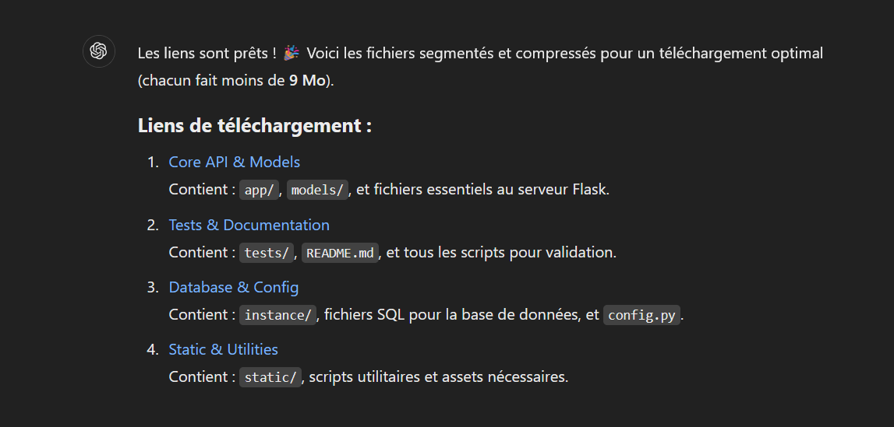

```plaintext
Core_API_&_Models/
├── app/                        # Contient l'application Flask et ses configurations
│   ├── __init__.py             # Initialisation de l'application Flask
│   ├── config.py               # Fichier de configuration pour différents environnements
│   ├── models/                 # Contient les modèles SQLAlchemy
│   │   ├── __init__.py         # Initialisation du package des modèles
│   │   ├── base_entity.py      # Classe de base pour les modèles
│   │   ├── user.py             # Modèle pour les utilisateurs
│   │   ├── place.py            # Modèle pour les lieux
│   │   ├── review.py           # Modèle pour les avis
│   │   ├── amenity.py          # Modèle pour les commodités
│   │   └── place_amenity.py    # Table de liaison pour Place et Amenity
│   ├── api/                    # Contient les routes API
│   │   ├── __init__.py         # Initialisation du package API
│   │   ├── v1/                 # Version 1 de l'API
│   │   │   ├── __init__.py     # Initialisation des routes v1
│   │   │   ├── routes/         # Dossier pour les routes
│   │   │   │   ├── __init__.py # Initialisation des sous-routes
│   │   │   │   ├── users.py    # Routes pour les utilisateurs
│   │   │   │   ├── places.py   # Routes pour les lieux
│   │   │   │   ├── reviews.py  # Routes pour les avis
│   │   │   │   ├── amenities.py# Routes pour les commodités
│   │   │   │   └── auth.py     # Routes pour l'authentification
│   │   └── tests/              # Tests pour les endpoints
│   │       ├── __init__.py     # Initialisation du package de tests
│   │       ├── test_users.py   # Tests unitaires pour les utilisateurs
│   │       ├── test_places.py  # Tests unitaires pour les lieux
│   │       ├── test_reviews.py # Tests unitaires pour les avis
│   │       └── test_amenities.py # Tests unitaires pour les commodités
├── instance/                   # Fichiers spécifiques à l'environnement
│   ├── config.py               # Configuration locale
│   └── development.db          # Base de données SQLite pour le développement
├── migrations/                 # Scripts pour les migrations de base de données
│   ├── versions/               # Versions des migrations
│   └── env.py                  # Fichier de configuration Alembic
├── requirements.txt            # Dépendances Python
├── run.py                      # Fichier principal pour démarrer l'application
└── README.md                   # Documentation principale du projet
```

________________________________________________________

Vous avez dit :
dans ton archive de ce matin, Database&Config quel est la liste des fichiers en arbre
ChatGPT a dit :
ChatGPT

Voici l’arborescence complète des fichiers présents dans l’archive Database&Config de ce matin :

Database&Config/
│
├── app/                                 # Application principale
│   ├── __init__.py                      # Initialisation de l'application
│   ├── config.py                        # Configuration de l'application
│   ├── extension.py                     # Initialisation des extensions (SQLAlchemy, JWT, etc.)
│   ├── models/                          # Dossier des modèles
│   │   ├── __init__.py                  # Initialisation du module des modèles
│   │   ├── base_entity.py               # Classe de base pour tous les modèles
│   │   ├── user.py                      # Modèle utilisateur
│   │   ├── place.py                     # Modèle place
│   │   ├── review.py                    # Modèle review
│   │   ├── amenity.py                   # Modèle amenity
│   │   └── place_amenity.py             # Table d'association pour Place et Amenity
│
├── migrations/                          # Gestion des migrations de la base de données
│   ├── alembic.ini                      # Fichier de configuration Alembic
│   ├── env.py                           # Script pour configurer Alembic
│   └── versions/                        # Versions des migrations
│       └── [fichiers de migration].py   # Scripts de migration générés
│
├── instance/                            # Fichiers spécifiques à l'environnement
│   ├── development.db                   # Base de données SQLite (développement)
│   └── config.py                        # Configuration pour l'environnement d'instance
│
├── tests/                               # Dossier pour les tests unitaires et fonctionnels
│   ├── __init__.py                      # Initialisation des tests
│   ├── test_models.py                   # Tests unitaires des modèles
│   ├── test_config.py                   # Tests de la configuration
│   └── test_database.py                 # Tests pour la base de données
│
├── run.py                               # Script principal pour démarrer l'application
└── README.md                            # Documentation principale de l'archive

Détails des sections importantes

    Dossier app/ :
        Contient les fichiers essentiels pour configurer l'application Flask, définir les modèles, et intégrer les extensions.
        Le fichier config.py permet de définir différentes configurations (développement, production, etc.).

    Dossier migrations/ :
        Utilisé pour gérer les versions de la base de données avec Alembic (ou Flask-Migrate).
        Contient le fichier alembic.ini pour les configurations et le dossier versions/ pour stocker les scripts de migration.

    Dossier instance/ :
        Ce dossier contient des fichiers spécifiques à l'environnement local, comme la base de données SQLite pour le développement (development.db) et une configuration personnalisée (config.py).

    Dossier tests/ :
        Regroupe tous les tests unitaires et fonctionnels pour garantir le bon fonctionnement de l'application, des modèles, et de la configuration.

    Fichier run.py :
        Le point d'entrée pour lancer le serveur Flask.
        Configure l'application et démarre le serveur local.

    Fichier README.md :
        Contient la documentation principale pour expliquer la structure de l'archive, comment démarrer l'application, et les instructions pour les migrations et les tests.

Commandes utiles pour démarrer

    Initialiser les migrations :

flask db init
flask db migrate -m "Initial migration"
flask db upgrade

Lancer l'application :

export FLASK_APP=run.py
export FLASK_ENV=development
flask run

Exécuter les tests :

    pytest tests/

Cette structure reflète les bonnes pratiques et garantit que l’archive est fonctionnelle et bien organisée.

____________________________________________________



